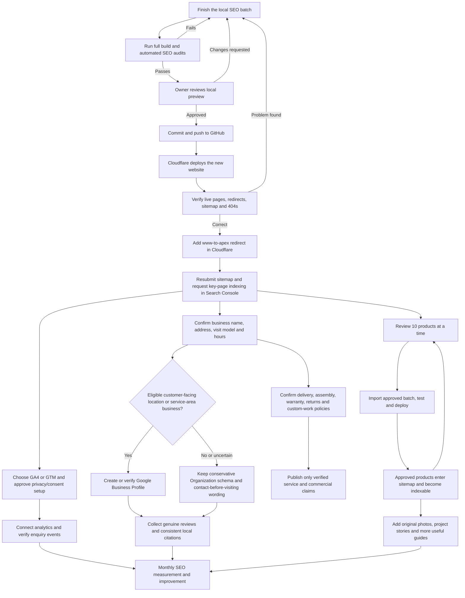

# Lucky Interiors SEO: Simple Roadmap

Updated: 19 July 2026

This document separates four states that were previously mixed together:

- **Done locally:** implemented on this computer, but not necessarily live.
- **Verified locally:** automated tests/build have passed on this computer.
- **Live:** committed, pushed to GitHub and deployed by Cloudflare.
- **External:** completed in Cloudflare, Google or another account outside the website code.

## Current Position

The major SEO upgrade is implemented in the local workspace, but it is not yet on GitHub or the live website. The GitHub `main` branch and `origin/main` are still at commit `bfde3d3`, while the SEO files are currently uncommitted local changes.

The practical legacy-versus-new image policy is now implemented locally. Existing images remain honestly unverified, while every future product must carry image evidence before SEO approval. The full build and visual owner review are still required before deployment.

## Flow Chart

## Execution Checklist

### Stage 1: Finish and Stabilize the Local Work

- [x] **1. Finish the legacy image policy** - **Completed locally**
  - What it does: treats pre-existing catalog images as legacy records without pretending that rights evidence exists, while requiring stronger records for newly added products.
  - Impact: keeps product approval practical without weakening the standard for future catalog additions.
  - What you need to do: nothing unless Codex asks you to identify the origin of a particular new image.

- [ ] **2. Run the complete production build and SEO audits** - **Codex task; blocking**
  - What it does: checks all generated pages, links, titles, canonicals, schema, sitemap rules, claims, redirects and product-quality rules.
  - Impact: prevents a large catalog-wide SEO error from being published.
  - What you need to do: nothing; review any real business-data questions raised by a failed check.

- [ ] **3. Review the local preview** - **You + Codex; blocking**
  - Check the homepage, Contact, About, five priority categories, two guides, one unapproved product, search, and a missing URL.
  - Impact: confirms that technically correct pages also look and read correctly to customers.
  - What you need to do: open the preview URL Codex provides and report any wording/design issue. Then explicitly approve deployment.

### Stage 2: Publish the SEO Foundation

- [ ] **4. Commit and push the SEO batch** - **Codex task after your approval**
  - What it does: records the changes in GitHub and triggers Cloudflare deployment.
  - Impact: local work has no SEO effect until this happens.
  - What you need to do: say that the reviewed version may be pushed.

- [ ] **5. Verify the Cloudflare deployment** - **Codex can test; you check the dashboard if needed**
  - Verify the homepage and important pages return `200`, trailing-slash duplicates return `301`, and a made-up URL returns `404`.
  - Impact: confirms Google receives the intended route-specific HTML rather than the old React shell or incorrect status codes.
  - What you need to do: confirm Cloudflare shows a successful latest deployment if Codex cannot access the signed-in dashboard.

- [ ] **6. Add the `www` to non-`www` redirect** - **You or Codex in your signed-in Cloudflare browser; external and blocking for URL cleanup**
  - Redirect `www.luckyinteriorsfurniture.com` to `https://luckyinteriorsfurniture.com` with a one-hop `301`.
  - Impact: combines duplicate-domain ranking signals instead of splitting them between two hostnames.
  - What you need to do: follow `CLOUDFLARE_SEO_SETUP.md`, or let Codex guide the signed-in browser session.

- [ ] **7. Resubmit the sitemap in Google Search Console** - **You or Codex in your signed-in Google session; external**
  - Submit `https://luckyinteriorsfurniture.com/sitemap.xml` only after the new deployment is live.
  - Request indexing for the homepage, About, Contact, five priority categories and two guides.
  - Impact: helps Google discover the improved pages sooner. It does not guarantee rankings.
  - What you need to do: use the verified Search Console property and confirm the sitemap eventually shows `Success`.

### Stage 3: Publish Strong Product Pages Gradually

- [ ] **8. Review the first batch of 10 products** - **You supply facts; dashboard/Codex handles structure**
  - Complete the required name, category, unique description, image, alt text and detail checks. Add dimensions, material/finish/color, price and availability when known, but do not guess.
  - Legacy image evidence is recommended and non-blocking; every new product requires confirmed rights and a source note.
  - Verify price and availability only if someone will keep them current.
  - Impact: turns selected product pages from `noindex,follow` into useful pages eligible for Google indexing.
  - What you need to do: make the factual approval decisions in the review dashboard. Do not guess missing facts.

- [ ] **9. Import, test and deploy each approved batch** - **Codex task; repeats after every batch**
  - What it does: updates the catalog, sitemap, robots directive and safe Product schema for approved pages.
  - Impact: grows indexable inventory without releasing hundreds of weak pages at once.
  - What you need to do: review the preview and authorize each push.

- [ ] **10. Repeat in batches of 10-25** - **Ongoing**
  - Start with Sofas, Beds, Dining Sets, Wardrobes and Centre Tables.
  - Impact: concentrates effort on categories already strengthened for Mumbai searches.
  - What you need to do: continue verifying actual product facts and image sources.

### Stage 4: Confirm Business Facts and Local SEO

- [ ] **11. Confirm business identity** - **You; prerequisite for stronger entity/local SEO**
  - Decide the customer-facing name and confirm the exact legal spelling of `Lucky Interiors Private Limited`.
  - Impact: consistent naming helps Google connect the website, Business Profile and citations.

- [ ] **12. Confirm location and visit rules** - **You; prerequisite for Google Business Profile and LocalBusiness schema**
  - Provide the exact postal address/postcode and state whether customers may visit without appointment, by appointment only, or not at all.
  - Confirm which location is the showroom and which is the private workshop.
  - Impact: incorrect storefront claims can cause profile suspension or customer confusion.

- [ ] **13. Confirm maintained opening hours** - **You**
  - Provide weekly hours and a holiday-hours process.
  - Impact: enables accurate website/profile hours and prevents wasted customer visits.

- [ ] **14. Decide and verify Google Business Profile eligibility** - **You/Google; external**
  - Do this only after Steps 11-13. Google may require signage, video, mail, phone or business documents.
  - Impact: a valid profile is the main route into Google Maps and local-pack searches.

- [ ] **15. Confirm operational policies** - **You; prerequisite for publishing commercial claims**
  - Document delivery areas/fees, assembly, installation, measurements, custom sizing, lead times, warranty, returns, cancellations and damage handling.
  - Impact: useful verified policies improve trust and conversion; guessed policies create legal and customer-service risk.

### Stage 5: Measurement

- [ ] **16. Choose GA4 or Google Tag Manager** - **You create/own the external account**
  - For the present site, direct GA4 is the simpler option; GTM is more flexible if several marketing tags will be added later.
  - Impact: lets the business measure organic WhatsApp, phone, email, map and product enquiries.
  - What you need to do: provide one `G-...` ID or one `GTM-...` ID and approve the privacy/consent approach.

- [ ] **17. Connect and test analytics** - **Codex task after Step 16**
  - Impact: SEO can then be judged by qualified enquiries, not only visits or rankings.
  - What you need to do: perform a few test clicks and later record whether enquiries became quotes or sales.

### Stage 6: Authority and Long-Term Growth

- [ ] **18. Add original business evidence** - **You/photographer; external input**
  - Photograph real products, rooms, installations, access challenges and completed projects with permission.
  - Impact: creates trustworthy, unique content for product pages, image search, guides and social media.

- [ ] **19. Collect genuine reviews** - **Real customers; external**
  - Impact: improves trust and local conversion. Never buy or fabricate reviews.

- [ ] **20. Earn relevant mentions and links** - **Business relationships; external**
  - Seek accurate mentions from Mumbai designers, architects, associations, publications, suppliers and permissioned customer projects.
  - Impact: builds the authority needed to compete for non-branded searches.

- [ ] **21. Review performance every month** - **You + Codex**
  - Track Search Console impressions/clicks/indexing, approved-product count, Core Web Vitals and organic enquiries.
  - Impact: reveals which categories and pages produce business, so future work is based on evidence.

## Already Implemented Locally

These items should be considered **done in local code, awaiting final integration/test/deployment**, not yet fully completed live:

- [x] Route-specific prerendered HTML for public pages.
- [x] Unique titles, descriptions, canonicals, H1s and safe schema.
- [x] Real 404 handling and trailing-slash redirect configuration.
- [x] A quality-controlled sitemap and `noindex,follow` for unapproved products/search/empty categories.
- [x] Improved homepage and five priority Mumbai category pages.
- [x] Better internal linking, commercial footer links, About, Privacy, Terms and two guides.
- [x] Product SEO quality gate and review-dashboard requirements.
- [x] Automated product, rendered-claim, crawl, sitemap and metadata audits.
- [x] Responsive lightweight header logo, asset caching and JavaScript chunk splitting.
- [x] Analytics event hooks for page views and enquiry actions; no vendor is connected yet.

## Tasks That Need Outside Help or Accounts

An SEO agency is not required for the current technical work. External involvement is limited to:

- Cloudflare and Search Console account access.
- Google Business Profile eligibility and verification.
- GA4 or GTM account ownership and privacy decisions.
- Accurate business/product/policy information from the owner.
- Image permissions and original photography.
- Genuine customer reviews and real third-party mentions/backlinks.

## The Next Three Actions

1. Ask Codex to finish the current legacy-image-policy integration and run the complete build/audit suite.
2. Review the local preview and approve or request changes.
3. After approval, ask Codex to commit and push the SEO batch; then verify Cloudflare before touching Search Console.
